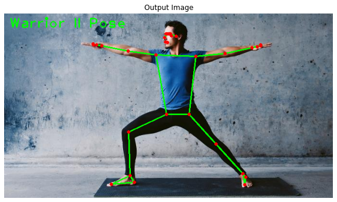

<!-- Improved compatibility of back to top link: See: https://github.com/othneildrew/Best-README-Template/pull/73 -->
<a name="readme-top"></a>
<!--
*** Thanks for checking out the Best-README-Template. If you have a suggestion
*** that would make this better, please fork the repo and create a pull request
*** or simply open an issue with the tag "enhancement".
*** Don't forget to give the project a star!
*** Thanks again! Now go create something AMAZING! :D
-->


<!-- PROJECT SHIELDS -->
<!--
*** I'm using markdown "reference style" links for readability.
*** Reference links are enclosed in brackets [ ] instead of parentheses ( ).
*** See the bottom of this document for the declaration of the reference variables
*** for contributors-url, forks-url, etc. This is an optional, concise syntax you may use.
*** https://www.markdownguide.org/basic-syntax/#reference-style-links
-->


<!-- PROJECT LOGO -->
<br />
<div align="center">
  <a href="https://github.com/othneildrew/Best-README-Template">
    
  </a>
</div>


<!-- TABLE OF CONTENTS -->
<details>
  <summary>Table of Contents</summary>
  <ol>
    <li>
      <a href="#about-the-project">About The Project</a>
      <ul>
        <li><a href="#built-with">Built With</a></li>
      </ul>
    </li>
    <li>
      <a href="#getting-started">Getting Started</a>
      <ul>
        <li><a href="#prerequisites">Prerequisites</a></li>
        <li><a href="#installation">Installation</a></li>
      </ul>
    </li>
    <li><a href="#usage">Usage</a></li>
    <li><a href="#roadmap">Roadmap</a></li>
    <li><a href="#contributing">Contributing</a></li>
    <li><a href="#license">License</a></li>
    <li><a href="#contact">Contact</a></li>
    <li><a href="#acknowledgments">Acknowledgments</a></li>
  </ol>
</details>


<!-- ABOUT THE PROJECT -->
## About The Project

It is a Yoga pose Classification App which will detect amongst five yoga classes i.e., ['Downdog', 'Goddess', 'Plank', 'Tree', 'Warrior2']

This is my NAVTTC FYP for the course of AI(Machine Learning and Deep Learning). I got the inspiration to create this project due to following:
* Your time should be focused on creating something amazing. A project that solves a problem and helps others
* You shouldn't be doing the same tasks over and over like creating a Deep Learning model.
* You should implement DRY principles to the rest of your life :smile:

Of course, no one-Knowledge will serve all projects since your needs may be different. So I'll be adding more in the near future. You may also suggest changes by forking this repo and creating a pull request or opening an issue. Thanks to all the people have contributed to expanding this Project!


<p align="right">(<a href="#readme-top">back to top</a>)</p>


### Built With

This Project is made with the help of following:
* Python
* Streamlit
* MoveNet (Pose Estimation model)
* Custom-made Tensorflow DNN_classifier


<p align="right">(<a href="#readme-top">back to top</a>)</p>


<!-- GETTING STARTED -->
## Getting Started

In this tutorial i will guide you how to Download>Run>Deploy this project in your own system.

### Prerequisites

This is an example of how locally run this software and how to install essential libraries to run it.
First you need to have python 3.10.x version installed in your pc.
* python 3.10.x follow the link to download python version: (https://www.python.org/downloads/). Once, installed in your system then 
open any code editor like pycharm or vscode and make python 3.10.x as your project interpreter.
Now, click on the  terminal and start installing these libraries by using given commands.
* streamlit
  ```sh
  pip install streamlit
  ```
* OpenCv headless
  ```sh
  pip install opencv-python-headless
  ```
* Tensorflow
  ```sh
  pip install tensorflow
  ```
* Numpy
  ```sh
  pip install numpy
  ```
* Pillow
  ```sh
  pip install Pillow
  ```

<p align="right">(<a href="#readme-top">back to top</a>)</p>


<!-- USAGE EXAMPLES -->
## Usage

Now open your terminal again and run this command to run the app locally:
```sh
  streamlit run Yoga_pose_App.py
  ```

<p align="right">(<a href="#readme-top">back to top</a>)</p>


<!-- CONTACT -->
## Contact

Basim Bashir - [@LinkedIn](https://www.linkedin.com/in/basim-bashir-035403214/)

Project Link: [https://github.com/BasimBashir/YogaPose_Classifier_APP](https://github.com/BasimBashir/YogaPose_Classifier_APP)

<p align="right">(<a href="#readme-top">back to top</a>)</p>

